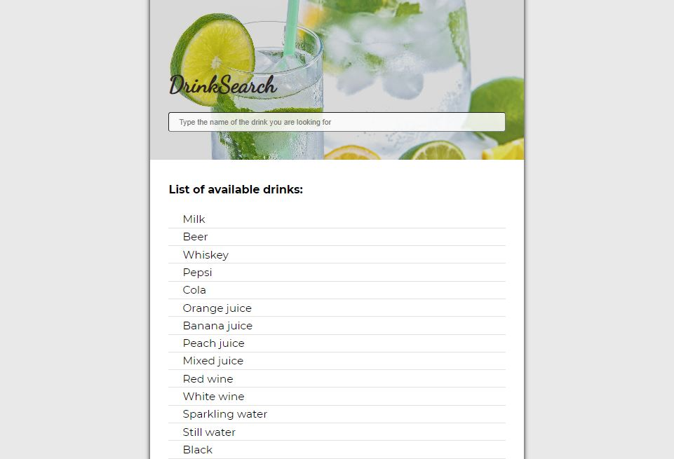

# Search Engine
This is simple apllication that allows to search the list of drinks.

* [General info](#general-info)
* [Technologies](#technologies)
* [Screenshots](#screenshots)
* [Setup](#setup)
* [Status](#status)
* [Inspiration](#inspiration)

## General info
I made this project to practice my skills related to JavaScript and web creating. 

## Technologies
Project is created with:
* HTML5
* CSS3
* JavaScript

## Screenshots

## Setup
You can see this project on-line using link: https://szymonsauer.github.io/search-engine-js/.
To run this project locally download the code and run in the Visual Studio Code program. 

## Status
Project is finished.

## Inspiration
Project based on Udemy course '[2021] 10 projektów w czystym JavaScript cz. 1'
